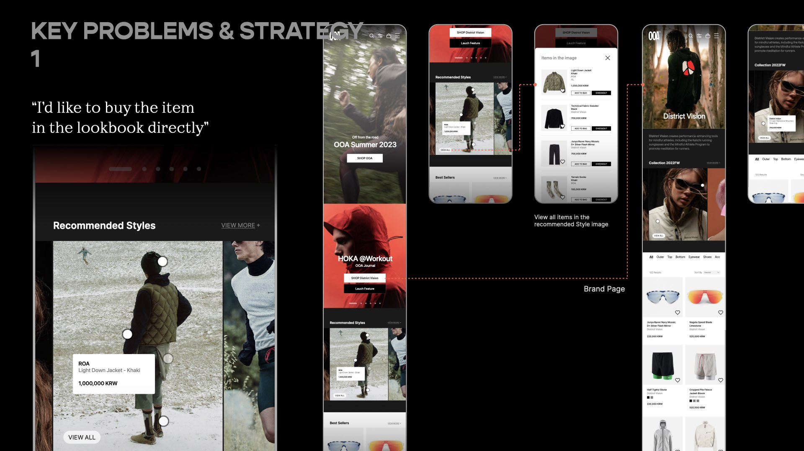
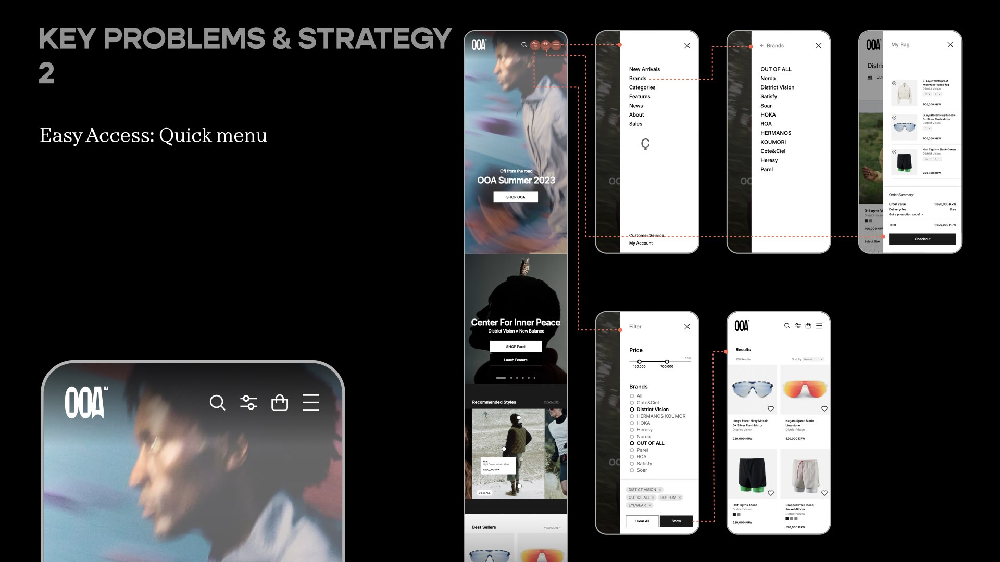
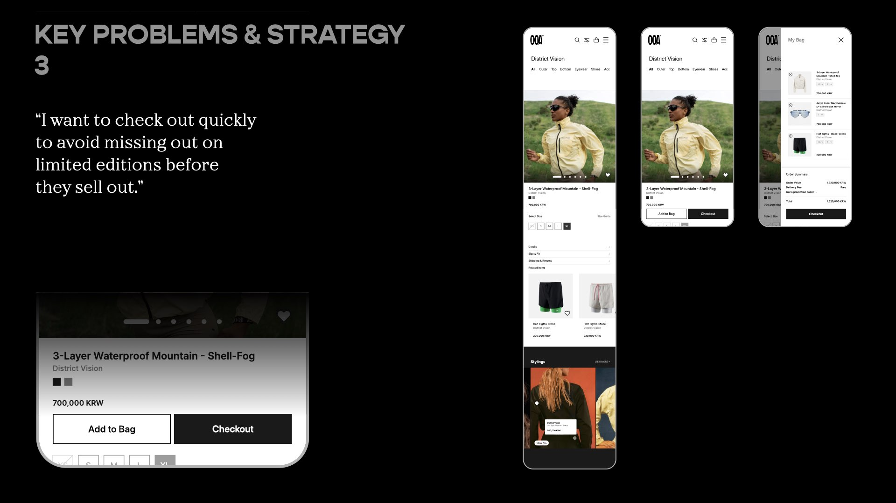
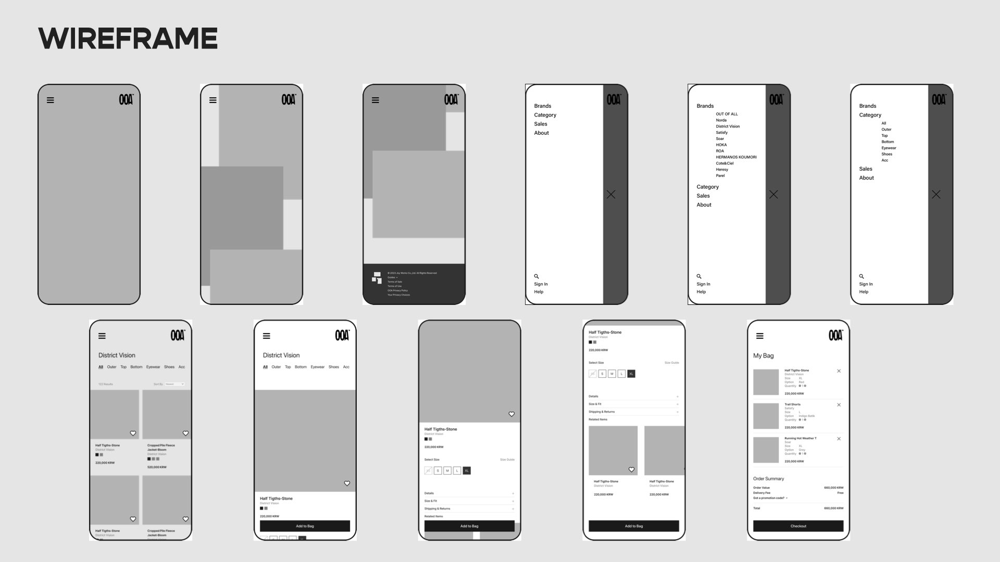

# OOA e-commerce platform development

OOA is a new e-commerce platform specializing in outdoor wear, launched by Joy Works, which also operates HOKA Korea.

This web development project focuses on seamlessly merging offline and online shopping experiences. It curates a diverse range of outdoor styles and lifestyle content, tackling challenges like booking limited editions, browsing personalized content, and streamlining payments. The aim is to improve the shopping experience for users, employees, and stores, positioning OOA as a leader in the outdoor lifestyle market.

-    gitHub URL: [Noej Ijkus](https://github.com/ijkuS)
-    Live Site URL: [OOA](https://ijkus.github.io/ooa-6/)


## Table of contents

-    [Overview](#overview)

     -    [Screenshot](#screenshot)
     -    [Goal](#goal)
     -    [Links](#links)

-    [My process](#my-process)

     -    [Planning](#planning)
          -    [App UX/UI planning](#app-uxui-planning)
          -    [Technical planning](#technical-planning)

-    [Challenges and Lessons](#challenges-and-lessons)

     -    [Build React environment with Next.js - To do next time](#react-environment-with-nextjs---to-do-next-time)
     -    [1. Build React environment without CRA](#1-build-react-environment-without-cra)
     -    [2. File structure setting](#2-file-structure-setting)
     -    [3. Skeleton of application (Navbar + Outlet)](#3-skeleton-of-application-navbar--outlet)
     -    [4. Authentication with Firebase](#4-authentication-with-firebase)
     -    [5. Login & logout functions with UI (Navbar button)](#5-login--logout-functions-with-ui-navbar-button)
     -    [6. Authentication, Authorization, Protected Routes](#6-authentication-authorization-protected-routes)
     -    [7. Admin: Add new products (with Firebase Realtime Database)](#7-admin-add-new-products-with-firebase-realtime-database)

     -    [8. Working Without TanStack Query Due to React Version Compatibility Issues](#8-working-without-tanstack-query-due-to-react-version-compatibility-issues)

     -    [9. Cart Page](#9-cart-page-with-firebsase-realtime-database)

     -    [Refactor: Optimistic Update - useQuery]()
     -    [Deployment: gitHub with gh-pages]

     -    [Frontend Global State Management](#frontend-global-state-management)

     -    [Random ID generator](#random-id-generator)

     -    [The difference of Argument, Parameter, Constructor, Property](#the-difference-of-argument-parameter-constructor-property)
     -    [git Tips: Delete a file from a Git repository](#git-tips-delete-a-file-from-a-git-repository)
     -    [SVG icon transformation](#svg-icon-transformation)

-    [Future Improvements](#future-improvements)
-    [Useful resources](#useful-resources)
-    [Author](#author)
-    [Acknowledgments](#acknowledgments)

## Overview

-    This project began as a client request, and I am now recreating it as a new version to practice React.
-    This project serves as an exercise to deepen familiarity with React and object-oriented programming (OOP).
-    The project is designed as a web application.

### Goal

User types: (A) Admins / (M) Memebers(Logged-in user) / (N) Non-members (users not logged in)

Users should be able to:

**Must have**

General

-    [x] See all products on the main homepage (A, M, N)
-    [x] See all product details (A, M, N)
     -    [x] Add to bag button (A, M)

SignUp & Bag(cart)

-    [x] Login/Logout/SignUp (A, M, N)
-    [x] Bag (A, M)
     -    [x] Add products in a cart
     -    [x] Edit items in a cart (remove, update options)

Add & Edit(A)

-    [x] Add new product data
-    [ ] Edit existing product data

**Good to have**

-    [ ] Search for a keyword
-    [ ] Toggle the color scheme between light and dark mode

### Links

-    gitHub URL: [Noej Ijkus](https://github.com/ijkuS)
-    Live Site URL: [OOA](https://ijkus.github.io/ooa-6/)

## My process

### Planning

#### App UX/UI Planning

UX/UI Strategy





**Large screen UI**

-    Landing page

```
-    header (navbar)
     -   Logo -> onclick: homepage

     -   New Arrivals
     -   Products
     -   Brands
     -   Sales

     -   Edit -> onclick: /products/addNew -- (A only)
     -   Bag -> onclick: /cart -- (A, L)
     -   User info (profile icon + name) -- (A, L)
     -   SignUp(Login/Logout)

-    main (Outlet part)
     -   banners or movieclips
     -   product card grid layout

-    footer
     -    brand and website information
```

-    Detail page

for logged-in users and visitors

```
-    Outlet part
     -   left: product images
     -   right:
         -  product name
         -  category
         -  price
         -  description
         -  option buttons
         -  decalaimer
         -  button: Add to bag

-    footer
     -    brand and website information
```

-    Add new product / Edit existing product

for admins

```
-    Outlet part
     -   left: multiple image preview of chosen file
     -   right:
         -  input: choose files (multiple files)
         -  input: product name
         -  input: price
         -  input: Category
         -  input: Description
         -  input: Options(separted by commas) / or set a dropdown menu
         -  button: Click to Upload
```

**Mobile UI**

```
* mobile UI

-    header / navbar
     -   Logo
     -   Quick Menu
         -     Search
         -     Bag
         -     Hamburger icon
               -     New Arrivals
               -     Brands
               -     Categories
               -     Features
               -     News
               -     About
               -     Sales

               -     Customer service
               -     My Account

-    main
     -    list of products
-    footer
     -    brand and website information
```

#### Basic interaction planning

-    Site URL structure

```
   - /   -> <home>
   - /products   -> <AllProducts>
   - /products/addnew -> <AddProducts> for admins
   - /products/[productId] -> <ProductDetail>
   - /carts -> <Cart>
```

-    Navbar + Outlet structure
     [Next.js: Route groups](https://nextjs.org/blog/layouts-rfc#multiple-data-fetching-methods-in-a-route:~:text=update%20the%20RFC.-,Route%20Groups,-The%20hierarchy%20of)

```
-    Click products button

-    Click Login button
      → popup input window (dialog)

```

#### Technical planning

-    Semantic HTML5 markup
-    CSS custom properties
-    Mobile-first workflow
-    [React](https://react.dev/)
-    [JavaScript](https://developer.mozilla.org/en-US/docs/Web/JavaScript)
-    [Next.js](https://nextjs.org/)

     -    middleware (Authorization, Protected Routes)

-    [TanStack Query v5](https://tanstack.com/query/latest)
-    [React Router](https://reactrouter.com/en/main)
-    [Firebase](https://firebase.google.com/)
     -    Authentification
     -    Realtime database
     -    Storage
-    [Recoil](https://recoiljs.org/)

## Challenges and Lessons

### Build React environment with Next.js - To do next time

Effectively managing communication between the client and server sides proved challenging due to my limited understanding of Next.js. While implementing TanStack Query, I encountered persistent synchronization issues between the cart icon quantity in the Navbar and the item count within the cart. These errors were likely caused by client-server data synchronization inconsistencies. To address this, I plan to deepen my knowledge of Next.js and revisit this implementation in the future.

### 1. Build React environment without CRA

My focus is on reimplementing the OOA web application using React. I aim to set up a development environment from scratch, intentionally avoiding the use of Create React App (CRA).

### 2. File structure setting

Details: [Basic interaction planning](#basic-interaction-planning)

### 3. Skeleton of application (Navbar + Outlet)

-    **Create Outlet layout Without React router dom**

Issue: since react-router-dom is not working Next.js,

**Solution**: I used the existing features,[Pages and Layouts](https://nextjs.org/docs/pages/building-your-application/routing/pages-and-layouts), in Next.js.

Without `_app.js`, the Navbar+Outlet layout does not work. Layouts are nested by default.

Reference:
[Nested layouts and routes in Next.js](https://www.youtube.com/watch?v=69-mnojSa0M)
[Next.js: Nesting layout. ](https://nextjs.org/blog/layouts-rfc#:~:text=inside%20dashboard.-,Nesting%20Layouts,-Layouts%20are%20nested)
[Next.js: Route groups](https://nextjs.org/blog/layouts-rfc#multiple-data-fetching-methods-in-a-route:~:text=update%20the%20RFC.-,Route%20Groups,-The%20hierarchy%20of)
[Next.js: Data fetching](https://nextjs.org/blog/layouts-rfc#multiple-data-fetching-methods-in-a-route:~:text=the%20children%20prop.-,Data%20fetching,-It%20will%20be)
Q. Will it work for login logout authentication to handle all site, not just layout?

-    Initial page structure and file tree

```
src
 ┣ app
 ┃ ┣ components
 ┃ ┃ ┗ Navbar.jsx
 ┃ ┣ dashboard
 ┃ ┃ ┗ layout.js
 ┃ ┣ favicon.ico
 ┃ ┣ globals.css
 ┃ ┣ layout.js
 ┃ ┣ page copy.js
 ┃ ┗ page.js
 ┗ pages
 ┃ ┣ _app.js
 ┃ ┣ add-new-page.jsx
 ┃ ┣ all-products.jsx
 ┃ ┣ cart.jsx
 ┃ ┣ notfound.jsx
 ┃ ┗ product-detail.jsx

```

### 4. Authentication with Firebase

-    Install [Firebase](https://firebase.google.com/) -> Create `fbase.js`(src/app/api/fbase.js)

     -    **Important**: Refrain from using the name "firebase.js." to avoid potential conflicts with other files

-    Build firebase authentication following the [guide](https://firebase.google.com/docs/build?authuser=0&%3Bhl=ko&hl=ko&_gl=1*1idhrwr*_up*MQ..*_ga*NTQwNTQwNTgzLjE3Mjk4OTg5NDE.*_ga_CW55HF8NVT*MTcyOTkwMTYxMS4yLjEuMTcyOTkwMjgwOS4xNC4wLjA.)

-    `fbase.js`: Protect important keys putting in `.env` (apiKey, authDomain, databaseURL, projectId, appId)

     -    function login / logout
     -    [Manage Users in Firebase](https://firebase.google.com/docs/auth/web/manage-users?hl=en&authuser=0&_gl=1*1t9v0u8*_up*MQ..*_ga*MTkwMjg3OTI4NS4xNzMwMzQ4NDA3*_ga_CW55HF8NVT*MTczMDM0ODQwNy4xLjAuMTczMDM0ODQwNy4wLjAuMA..#get_the_currently_signed-in_user)
     -    funtion for [Authentication state](https://firebase.google.com/docs/auth/web/start?hl=ko&authuser=0&_gl=1*11jfqco*_up*MQ..*_ga*NTQwNTQwNTgzLjE3Mjk4OTg5NDE.*_ga_CW55HF8NVT*MTcyOTkwMTYxMS4yLjEuMTcyOTkwMjk0Mi4wLjAuMA..)

-    [firebase google login build document](https://firebase.google.com/docs/auth/web/google-signin?hl=ko&authuser=0&_gl=1*1bzde14*_up*MQ..*_ga*NTQwNTQwNTgzLjE3Mjk4OTg5NDE.*_ga_CW55HF8NVT*MTcyOTkwMTYxMS4yLjEuMTcyOTkwMjk0Mi4wLjAuMA..)

-    Issue: Due the type checking of TypeScript, I had to change the firebase API into TS, need to handle better between login and logout user state.

-    **Solution**: Build authentication with email option and make interface of user data and state to handle efficiently

[Ref: Implementing Firebase auth in React js, Typescript, Vite js](https://medium.com/@sajadshafi/implementing-firebase-auth-in-react-js-typescript-vite-js-88465ac84170)
[Ref: Firebase Local Emulator Suite, createUserWithEmailAndPassword](https://firebase.google.com/docs/auth/web/start?hl=ko#web-modular-api_1)

### 5. Login & logout functions with UI (Navbar button)

### 6. Authentication, Authorization, Protected Routes

I created a separated repository to understand about the different setting for authentication, authorization, and protected routes in Next.js from React without React-router-dom library.
[Implementing User Authentication and Authorization with Next.js and Firebase](https://github.com/ijkuS/next-react-auth-practice-4)

-    Authentication with firebase authentication and realtime database
-    Authorization for user types (Admins, Members, Visitors)
-    Protected routes with middleware

-    User types: (A) Admins / (M) Memebers(Logged-in user) / (N) Non-members (users not logged in)
-    Create different screen layouts for three types of users.

-    Build Firebase realtime database

     -    Distinguish admins from logged-in users by storing their UID in the Firebase Realtime Database.

          -    Non-members: Only show "All Products" and "SIGN IN" buttons.

               -    Restrict access to other menu routes even if entered directly in the address bar, redirecting them to Home.
               -    Prevent access to routes after logging out by using the back button, redirecting them to Home.

          -    Members: Show "All Products," "Carts," and "SIGN OUT" buttons.

               -    Restrict access to other menu routes even if entered directly in the address bar, redirecting them to Home.
               -    Prevent access to routes after logging out by using the back button, redirecting them to Home.

          -    **Admin users**: Show all four buttons — "All Products," "SIGN OUT," and "Add New."

-    function adminUser(user)
     To check if the logged-in user is admin

### 7. Admin: Add new products (with Firebase Realtime Database)

-    Creating the Basic Structure for `addnew.jsx` UI (Building a New Product Entry Form)

     -    Using useState to Create setProduct – for updating the product state.
     -    Using useState to Create setFiles – for managing files state separately, as file inputs require URL handling and need a distinct useState.
          -    Allow up to 10 image files.
          -    Enable users to overwrite the image file list up to 10 files (e.g., if 2 images are uploaded and then 3 more are added, show a total of 5 uploaded images and inform the user they can add up to 5 more).
     -    Using e.target – to individually retrieve name, value, and files.
     -    Conditionally Executing – if name is file, execute setFile() and return; otherwise, execute setProduct().

### 8. Working Without TanStack Query Due to React Version Compatibility Issues

Due to the current version of React, an installation error occurred with TanStack Query, which I usually used in the previous projects. Using the app without it for now.

```json
     "next": "15.0.2",
     "react": "19.0.0-rc-02c0e824-20241028",
     "react-dom": "19.0.0-rc-02c0e824-20241028",
```

[Ref: Next.js fetch and TanStack Query](https://blog.toktokhan.dev/how-to-use-effectivelynext-js-fetchtanstack-query-333c28168e92)

### 9. Cart page with Firebsase Realtime Database

-    Click 'Add to Bag' button -> bring the selected product data
-    Make functions related to Cart(Bag)
     -    getCart(): Bring products in a cart
     -    addOrUpdateToCart(): Add/Update items in a cart
     -    removeFromCart(): Remove items in a cart

### Optimistic Updates with TanStack Query

TanStack Query is a powerful library for caching and managing data related to API calls. One of its standout features is support for optimistic updates, which allows the UI to reflect changes even before the server confirms the update.

Optimistic updates enable immediate UI feedback. For instance, when a user likes a post, the UI can increment the like count instantly, without waiting for the server's response. This provides a smoother and more responsive user experience.

While optimistic updates can greatly enhance the user experience, they require careful handling. If the server request fails, the application must revert the UI to its previous state. This is where implementing a rollback mechanism becomes essential. For this reason, it’s best to use optimistic updates selectively, in scenarios where quick feedback is crucial and the risk of failure is low.

In TanStack Query, you can perform optimistic updates using the onMutate option provided by the useMutation hook. The onMutate function runs before the API call, making it a key part of implementing optimistic updates. It allows you to:

-    Update the current data cache to reflect the changes immediately.
-    Modify the UI for a seamless user experience.
-    Implement rollback logic to restore the previous state if the request fails.

This combination of features makes TanStack Query an excellent choice for managing data while improving the perceived performance of your application.

### Frontend Global State Management

-    Definition of state management in frontend

1. UI/UX
   Recoil

[Ref in KO: Common Pitfalls When Using Next.js and Strategies to Overcome Them](https://reactnext-central.xyz/blog/nextjs-overivew/nextjs-challenges)
[Ref in KO: Comparison of 7 State Management Methods in React and Next.js](https://ux.stories.pe.kr/342#google_vignette)
[Ref in KO: Migration from react to Next.js](https://jwookj.tistory.com/117)

### Random ID generator

Since UUID library often conflicts Next.js, I simply created an equation to make a unique id below.

```javascript
this.id = `memo-${Date.now()}-${Math.floor(Math.random() * 100)}`;
```

### The difference between Authentication and Authorization

[Ref: Authentication vs. authorization: What’s the difference?](https://www.ibm.com/think/topics/authentication-vs-authorization)

### The difference of Argument, Parameter, Constructor, Property

인자(Argument), 파라미터(Parameter, 매개변수), 생성자(Constructor), 프로퍼티(Property)

### git Tips: Delete a file from a Git repository

[Reference](https://sentry.io/answers/delete-a-file-from-a-git-repository/)

case: Remove a file or folder on the remote only

```shell
   git rm --cached unwanted-file.txt
   git commit -m "remove unnecessary files"
   git push origin main

```

case: Remove a file or folder from the local

```shell
   git rm unwanted-file.txt
   git commit -m "remove unnecessary files"
   git push origin main

```

### SVG icon transformation

-    Select the desired icon from the React-Icons site, then open developer tools to save the SVG portion.
-    Search "SVG to ICO" or "PNG to ICO" on Google.
-    Use one of the sites to convert the file to ICO format and save it.
-    If it's an SVG file, you can modify the code to set or change the color as needed.

## Future Improvements

-    Q. For API, is it okay to use JavaScript file, or need to change into TypeScript file?

Due the type checking of TypeScript, I had to change the firebase API into TS, need to handle better between login and logout user state.

[Ref: Implementing Firebase auth in React js, Typescript, Vite js](https://medium.com/@sajadshafi/implementing-firebase-auth-in-react-js-typescript-vite-js-88465ac84170)
[Ref: Implementing Firebase auth with Typescript](https://ph-biginner.tistory.com/180)

## Useful resources

**Design References**

-    [Google material3 color palette](https://m3.material.io/styles/color/static/baseline)
-    [Google material component git](https://github.com/material-components/material-components-android/blob/master/docs/theming/Color.md)
-    [Google design guidelines for developers](https://developers.google.com/assistant/interactivecanvas/design)
-    [Google Material 3](https://m3.material.io/)
-    [CSS Box shadow examples](https://getcssscan.com/css-box-shadow-examples)
-    [Google color palette](https://partnermarketinghub.withgoogle.com/brands/google-news/visual-identity/color-palette/) -[Google Design for Driving](https://developers.google.com/cars/design/automotive-os/design-system/color)
-    [TailwindCSS color palette](https://tailwindcss.com/docs/customizing-colors)
-    [material ui](https://materialui.co/colors)

**VSC Tips**

-    [Multi selections](https://code.visualstudio.com/docs/editor/codebasics)
-    VSC, Global code snippets: command palette -> snippet -> Global code snippets

command palette -> snippet -> Global code snippets
snippets.code-snippets

```json
{
	"reactFunction": {
		"prefix": "rfc",
		"body": "import React from 'react';\n\nexport default function ${1:${TM_FILENAME_BASE}}() {\n\treturn (\n\t\t<div>\n\t\t\t\n\t\t</div>\n\t);\n}\n\n",
		"description": "Creates a React Function component"
	},
	"reactStatelessImplicitReturn": {
		"prefix": "rsi",
		"body": "import React from 'react';\n\nexport const ${1:${TM_FILENAME_BASE}} = (props) => (\n\t\t\t$0\n\t);",
		"description": "Creates a React Function component"
	},
	"Import Module CSS": {
		"prefix": "si",
		"body": ["import styles from './$TM_FILENAME_BASE.module.css'"],
		"description": "Import PostCSS"
	},
	"ClassName": {
		"prefix": "cn",
		"body": ["className="],
		"description": "Adding className"
	}
	// "ClassName": {
	//     "prefix": "cn",
	//     "body": ["className={styles.$1}"],
	//     "description": "Adding className"
	// }
}
```

**Git Tips**

-    [Terminal markdown](https://github.com/Evoniuk/terminal-markdown)

## Author

-    [Noej Ijkus](https://github.com/ijkuS)
-    [email](ijkus.noej@gmail.com)

## Acknowledgments
